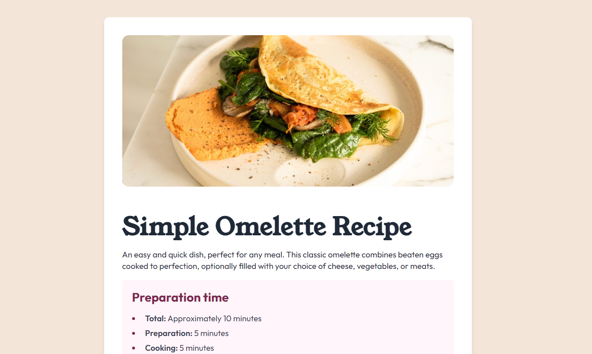

# Frontend Mentor - Recipe page solution

This is a solution to the [Recipe page challenge on Frontend Mentor](https://www.frontendmentor.io/challenges/recipe-page-KiTsR8QQKm). Frontend Mentor challenges help you improve your coding skills by building realistic projects. 

## Table of contents

- [Overview](#overview)
  - [Screenshot](#screenshot)
  - [Links](#links)
- [My process](#my-process)
  - [Built with](#built-with)
  - [Useful resources](#useful-resources)
- [Author](#author)

## Overview
This project is a responsive recipe page developed for a Frontend Mentor challenge. It features a clean layout with sections for ingredients, instructions, and nutritional information, styled using Tailwind CSS for rapid and consistent design. The goal was to create a visually appealing and accessible recipe page suitable for both mobile and desktop devices.

### Screenshots

### Links

- Solution URL: [Solution URL](https://github.com/JasperMunene/recipe)
- Live Site URL: [Live Site](https://simpleomeletterecipe1.netlify.app/)

## My process
HTML and Tailwind Setup: Set up HTML structure with semantic elements and apply Tailwind CSS for styling.

Content Integration: Integrate recipe details including hero section, description, preparation time, ingredients, instructions, and nutritional information.

Responsive Design: Implement a mobile-first approach, ensuring the page is visually appealing and functional across all screen sizes.

Testing and Refinement: Conduct thorough testing to optimize layout and functionality, making adjustments as needed.

Documentation and Deployment: Document development insights and deploy the finalized project to ensure it meets design and usability standards.

### Built with
- Semantic HTML5 markup
- Mobile-first workflow
- [Tailwind](https://tailwindcss.com/) - A utility-first CSS framework 

### Useful resources
- [Tailwinnd CSS Docs](https://tailwindcss.com/docs/) - Tailwind CSS documentation has been instrumental in streamlining my styling process by providing a comprehensive set of utility classes for rapid and efficient design implementation.

## Author
- Website - [Jasper](https://jaspermuneneportfolio.netlify.app/)
- Frontend Mentor - [@JasperMunene](https://www.frontendmentor.io/profile/JasperMunene)
